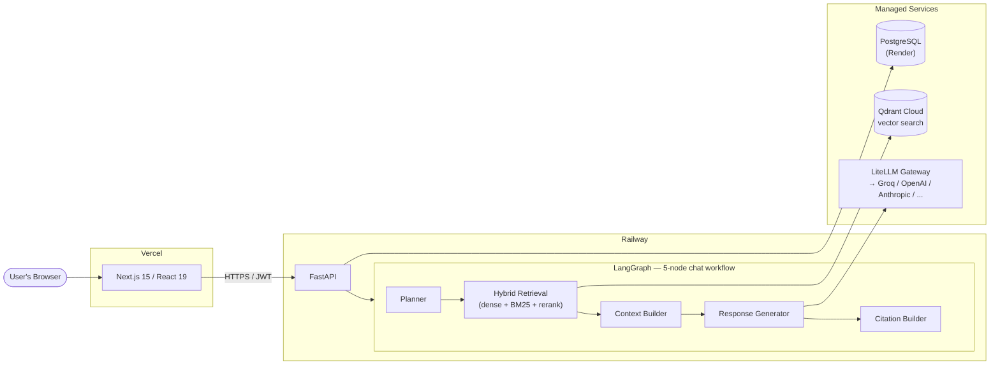

<div align="center">

# Enterprise Copilot Studio

**An enterprise-grade platform for composing, deploying, and chatting with AI copilots grounded in your own organization's documents.**

Hybrid retrieval-augmented generation · LangGraph orchestration · Multi-tenant JWT auth · Streaming chat with citations

[](frontend/README.md)
[](backend/README.md)
[](backend/README.md#enterprise-ai-runtime-sprint-5)
[](backend/README.md#enterprise-retrieval-engine-sprint-3b)
[](#license)

[Live Demo](#) · [Backend Setup](backend/README.md) · [Frontend Setup](frontend/README.md) · [Architecture](#architecture)

</div>

---

## Live Demo

> **[your-app.vercel.app](#)** _— replace with the deployed Vercel URL._
>
> No demo account or seeded credentials are required — registration is
> self-service, and every new account gets its own private workspace
> automatically. See [Getting Started](#getting-started) below to spin up
> the full stack yourself instead.

## Screenshots

> _Add real screenshots here as the project evolves — a `docs/screenshots/`
> folder with a few PNGs (Dashboard, Copilot chat with citations, the
> Create Copilot wizard, Knowledge Sources) makes this section land far
> better than any amount of description below could. Suggested layout:_

| Dashboard | Copilot Chat |
|---|---|
| _docs/screenshots/dashboard.png_ | _docs/screenshots/chat.png_ |

| Create Copilot Wizard | Knowledge Sources |
|---|---|
| _docs/screenshots/wizard.png_ | _docs/screenshots/knowledge-sources.png_ |

## Overview

Enterprise Copilot Studio is a full-stack platform for building
retrieval-grounded AI assistants without writing RAG infrastructure from
scratch. A user creates an account (each gets an isolated workspace),
uploads documents into a knowledge source, composes a copilot around it
through a guided wizard, and starts chatting — with every answer citing
the specific document and page it came from.

The project was built to demonstrate what a *production* AI platform
actually requires beyond "call an LLM API": hierarchical document
chunking, hybrid dense + sparse retrieval, guardrails and PII masking,
JWT authentication with refresh-token rotation, multi-tenant data
isolation, and the operational realities of running all of that on
real, memory-constrained infrastructure.

**Two things worth knowing up front:**
- **Nothing here is a mock.** Registration, authentication, document
  indexing, retrieval, and chat all run against real infrastructure —
  PostgreSQL, Qdrant, and a real LLM provider — not stubbed data. Where
  something genuinely isn't built yet (a few roadmap features below), the
  UI says "Coming Soon" rather than pretending otherwise.
- **This shipped through real production incidents, not just local
  development.** The backend README documents an actual out-of-memory
  crash investigation on a constrained hosting tier, root-caused,
  fixed, and eventually resolved by migrating platforms — see
  [Engineering Highlights](#engineering-highlights) below.

## Key Features

**Copilots**
- Guided 5-step creation wizard (type → knowledge sources → model →
  capabilities → review) with a live "Copilot Marketplace" template
  gallery
- Full CRUD management, each copilot independently configured and
  linked to one or more knowledge sources

**Knowledge & Retrieval**
- PDF upload with drag-and-drop, background text extraction, and
  hierarchical chunking (document → section → paragraph)
- Hybrid retrieval: dense vector search (Qdrant) fused with BM25 sparse
  search via reciprocal rank fusion, then re-ranked and confidence-scored
- Every chat response carries citations back to the exact source
  document and chunk

**Chat**
- Real-time streaming responses (Server-Sent Events) with a typing
  indicator, Markdown rendering, and per-message regenerate/copy actions
- Confidence scoring and expandable citation cards on every answer
- Conversation memory, isolated per user and per copilot

**Authentication & Multi-Tenancy**
- Self-service registration — no seeded demo accounts — each new user
  gets an automatically named, isolated workspace (never derived from
  email domain, to avoid grouping strangers who share a personal email
  provider into one organization)
- JWT access + refresh tokens with rotation and revocation, 5-role RBAC
  seeded at migration time

**Guardrails**
- Prompt-injection and jailbreak pattern detection on input
- PII detection and masking, harmful-content filtering on output

## Architecture



A chat turn flows: **input guardrails** → orchestrator resolves the
copilot and loads windowed conversation history → the **LangGraph
workflow** runs planner → hybrid retrieval (query rewrite, semantic +
BM25 fusion, re-rank, confidence score) → context assembly → the
**LiteLLM gateway** calls the configured provider → citations are
extracted → **output guardrails** mask PII and check for harmful
content → both turns are persisted.

The database, vector store, and API are deliberately three separate
managed services rather than one bundled deployment — see the backend
README's [Production Deployment](backend/README.md#production-deployment-vector-store--redis)
section for exactly why, including a real production incident that
shaped this decision.

## Tech Stack

| | |
|---|---|
| **Frontend** | Next.js 15 (App Router) · React 19 · TypeScript · Tailwind CSS v4 · shadcn/ui · Framer Motion · Zustand · TanStack Query |
| **Backend** | FastAPI · Python 3.12 · SQLAlchemy 2.0 (async) · Alembic · Pydantic v2 |
| **AI / RAG** | LangGraph · LiteLLM (Groq, OpenAI, Anthropic, Azure OpenAI, Ollama) · LlamaIndex · fastembed (ONNX Runtime) |
| **Data** | PostgreSQL · Qdrant (vector search) |
| **Auth** | JWT (PyJWT) · bcrypt · role-based access control |
| **Infra** | Docker · Vercel (frontend) · Railway (API) · Render (PostgreSQL) · Qdrant Cloud |
| **Testing** | pytest / pytest-asyncio (backend, 123 tests) · TypeScript strict mode + production build verification (frontend) |

## Repository Structure

```
enterprise-copilot-studio/
├── frontend/     Next.js application — see frontend/README.md
├── backend/      FastAPI application — see backend/README.md
└── docs/         Product requirements & architecture notes
```

Each subfolder is self-contained with its own dependencies, environment
configuration, and README. This root document is intentionally an
overview — detailed setup, environment variables, API documentation,
and deployment steps live in the two guides below.

## Getting Started

```bash
git clone https://github.com/bamwhamboy/enterprise-copilot-studio.git
cd enterprise-copilot-studio
```

Then follow, in order:

1. **[backend/README.md](backend/README.md)** — spin up PostgreSQL,
   Qdrant, and the API (Docker Compose is the fastest path; migrations
   run automatically).
2. **[frontend/README.md](frontend/README.md)** — install and run the
   Next.js app against that API.

Once both are running, registration is the only path in — there's no
demo account to look for.

## Engineering Highlights

A few things worth knowing about how this was actually built, beyond
the feature list:

- **A real production incident, root-caused and resolved.** Indexing
  began failing in production with no traceback — just the process
  getting killed. That investigation is documented start to finish in
  the backend README: tracing it to PyTorch's own import overhead,
  replacing the embedding runtime with ONNX-based inference, discovering
  and fixing a *second*, unrelated cause (200MB of eagerly-imported chat
  dependencies loaded even for requests that never touched chat), and a
  *third* — an event-loop-blocking bug that could trigger a platform
  health-check kill independent of memory entirely. When the hosting
  tier's memory ceiling was still the limiting factor after three
  verified fixes, the conclusion was to migrate the API to a
  higher-memory platform rather than keep guessing in code — a real
  build-vs-buy tradeoff, not just a code problem.
- **A silent authentication bug in the vector database client.** An API
  key setting existed in config but was never actually passed to the
  Qdrant client — meaning it would appear to work while silently
  connecting unauthenticated. Found by tracing the actual client
  construction code, not assumed.
- **Multi-tenancy that avoids a real privacy pitfall.** New workspaces
  are never derived from a user's email domain — most people register
  with personal providers like Gmail, which would otherwise silently
  group unrelated strangers into the same organization.
- **Every fix in this repository is backed by a real test, not just
  reasoning about the code.** The backend's test suite runs against a
  real (in-memory) Qdrant and real PostgreSQL, not exclusively mocks —
  see the backend README's per-feature sections for what's verified
  where.

## Testing

```bash
# Backend
cd backend && pytest -v          # 123 tests

# Frontend
cd frontend && npm run build     # type-checked + production build
```

## Roadmap

A few items from the original product vision are intentionally not yet
built, and the UI says so rather than faking them: an AI cost/usage
dashboard, and native backend support for a handful of copilot
templates (Clinical Research, Customer Success, and a few others)
whose domain currently maps onto the closest existing category rather
than a dedicated one of its own — see the frontend's copilot template
catalog for exactly which.

## License

No license has been added to this repository yet — treat all rights as
reserved until one is. _(Consider adding a `LICENSE` file — MIT is a
common choice for a portfolio project like this.)_

## Author

Built by [**@bamwhamboy**](https://github.com/bamwhamboy).
