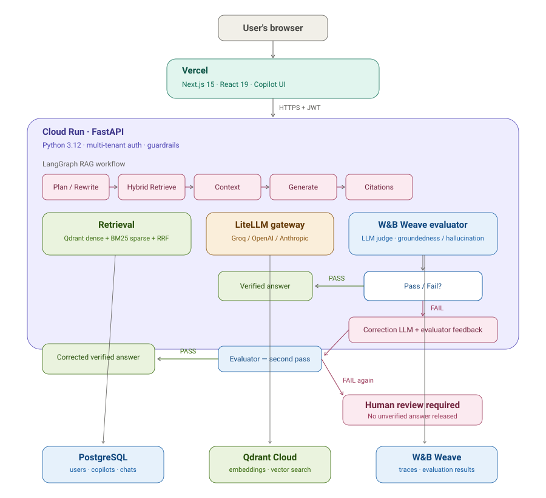

<div align="center">

# Enterprise Copilot Studio

**An enterprise-grade platform for composing, deploying, and chatting with AI copilots grounded in your own organization's documents.**

Hybrid retrieval-augmented generation · LangGraph orchestration · Multi-tenant JWT auth · Streaming chat with citations · LLM evaluation and self-correction

[](frontend/README.md)
[](backend/README.md)
[](backend/README.md#architecture)
[](backend/README.md#tech-stack)
[](https://wandb.ai/site/weave)
[](#license)

[Live Demo](#) · [Backend Setup](backend/README.md) · [Frontend Setup](frontend/README.md) · [Architecture](#architecture)

</div>

---

## Live Demo

> **[your-app.vercel.app](#)** _— replace with the deployed Vercel URL._
>
> No demo account or seeded credentials are required — registration is
> self-service, and every new account gets its own private workspace
> automatically. See [Getting Started](#getting-started) below to spin up
> the full stack yourself instead.

## Demo Video

> _Drop the video in here — on GitHub, the easiest way is to open this
> file in the web editor and drag the video file directly into the
> text area; GitHub uploads it and inserts a working embed link
> automatically. A short GIF of the chat-with-citations moment above
> the video is a nice touch too, but not required._

## Overview

Most companies have mountains of internal documents — HR policies,
legal contracts, product manuals, onboarding guides — and no easy way
for employees to actually get answers from them. People either dig
through PDFs themselves or ping a coworker and wait.

Enterprise Copilot Studio solves that: it lets any organization turn
its own documents into a chatbot that actually knows the material.
Upload an HR policy, and employees can ask "how many sick days do I
get?" and get a grounded answer — with citations pointing back to the
source material, so nobody has to just trust the AI blindly.

Each company that signs up gets its own private, isolated space —
nobody can see another organization's copilots, documents, or
conversations. Registration is instant and self-service: sign up, and
you're building your own AI assistant in minutes, no admin setup
required.

Under the hood, it's a full-stack platform for building
retrieval-grounded AI assistants without writing RAG infrastructure
from scratch: hierarchical document chunking, hybrid dense + sparse
retrieval, guardrails and PII masking, JWT authentication with
refresh-token rotation, multi-tenant data isolation, and a production
AI quality layer that evaluates generated answers and can request a
corrected answer before release.

## What Makes It Stand Out

**It doesn't just generate an answer — it verifies it.** Every answer
is grounded against retrieved enterprise content and carries source
citations. An LLM-based evaluator checks the generated response for
groundedness and hallucination. If the first answer fails evaluation,
the generation model receives evaluator feedback and produces a
corrected answer, which is evaluated again. A second failure is not
silently released as fact: it is routed toward human review.

**It shows its work.** Answers include citations back to the underlying
document and retrieved content, making it possible to inspect where a
response came from rather than treating the model as an authority.

**It's a real, working product — not a demo that only runs on one
laptop.** It's deployed with a real database, vector search, AI
providers, and managed cloud infrastructure behind it.

**Every company's data is genuinely private.** This wasn't an
afterthought — it's built in at every layer, so one organization's
documents, copilots, and chats are never visible to another, even by
accident.

**It survived real problems, not just a tutorial's happy path.**
Building this meant hitting genuine production issues — memory
pressure during indexing, authentication and CORS deployment issues,
and retrieval/generation integration problems — and fixing them using
instrumentation, tests, and production logs.

**It's flexible by design.** It isn't locked into one AI provider — it
can run through LiteLLM with providers such as Groq, OpenAI, Anthropic,
and others.

## Key Features

**Copilots**
- Guided 5-step creation wizard (type → knowledge sources → model →
  capabilities → review) with a live "Copilot Marketplace" template
  gallery
- Full CRUD management, each copilot independently configured and
  linked to one or more knowledge sources

**Knowledge & Retrieval**
- PDF upload with drag-and-drop, background text extraction, and
  hierarchical chunking (document → section → paragraph)
- Hybrid retrieval: dense vector search (Qdrant) fused with BM25 sparse
  search via reciprocal rank fusion, then re-ranked and confidence-scored
- Every chat response carries citations back to the exact source
  document and chunk

**AI Evaluation & Self-Correction**
- W&B Weave tracing and LLM-as-a-judge evaluation for generated answers
- Groundedness / hallucination checking against the retrieved context
- Structured evaluator feedback supplied to the generation model when
  an answer fails the quality gate
- One controlled correction attempt followed by a second evaluation
- Answers that fail the second evaluation are not treated as verified
  responses and can require human review
- Evaluation status and attempt metadata are available to the application
  for quality monitoring and future review workflows

**Chat**
- Real-time streaming responses (Server-Sent Events) with a typing
  indicator, Markdown rendering, and per-message regenerate/copy actions
- Evaluation-aware answer delivery so an unchecked first draft is not
  released before the quality gate
- Confidence scoring and expandable citation cards on every answer
- Conversation memory, isolated per user and per copilot

**Authentication & Multi-Tenancy**
- Self-service registration — no seeded demo accounts — each new user
  gets an automatically named, isolated workspace (never derived from
  email domain, to avoid grouping strangers who share a personal email
  provider into one organization)
- JWT access + refresh tokens with rotation and revocation, 5-role RBAC
  seeded at migration time

**Guardrails**
- Prompt-injection and jailbreak pattern detection on input
- PII detection and masking, harmful-content filtering on output
- Evaluation gate to reduce unsupported or hallucinated answers

## Architecture



The architecture now includes an explicit **AI quality-control loop**.
A chat turn flows through input guardrails → copilot/orchestrator →
LangGraph planning and query rewriting → hybrid retrieval → context
assembly → LiteLLM generation → citations → **W&B Weave LLM evaluation**.

If the evaluator passes the answer, it can be returned to the user. If
it detects an unsupported or hallucinated response, the generation model
receives the evaluator's feedback and produces one corrected answer.
That corrected answer is evaluated a second time. If it fails again,
the system does not silently keep regenerating increasingly speculative
answers; the response is treated as requiring human review.

Weave is the **evaluation and observability layer**, not the generator.
The configured LLM remains responsible for producing and correcting the
answer, while Weave provides the independent quality check and traces
for evaluation analysis.

The main runtime components are:

- **Vercel** — Next.js frontend and copilot UI
- **Cloud Run** — FastAPI backend and RAG orchestration
- **Qdrant Cloud** — dense vector retrieval
- **PostgreSQL** — users, organizations, copilots, documents and chat data
- **LiteLLM** — model-provider abstraction for generation
- **W&B Weave** — LLM evaluation, tracing and quality signals

The database, vector store, frontend, and API are deliberately separate
managed services rather than one bundled deployment. See the backend
README's [Deployment](backend/README.md#deployment) section for setup
steps and its [engineering log](backend/docs/ENGINEERING_LOG.md) for the
production incidents that shaped the design.

## Tech Stack

| | |
|---|---|
| **Frontend** | Next.js 15 (App Router) · React 19 · TypeScript · Tailwind CSS v4 · shadcn/ui · Framer Motion · Zustand · TanStack Query |
| **Backend** | FastAPI · Python 3.12 · SQLAlchemy 2.0 (async) · Alembic · Pydantic v2 |
| **AI / RAG** | LangGraph · LiteLLM · LlamaIndex · fastembed (ONNX Runtime) · W&B Weave |
| **Models / Providers** | Groq · OpenAI · Anthropic · configurable through LiteLLM |
| **Data** | PostgreSQL · Qdrant (vector search) |
| **Auth** | JWT (PyJWT) · bcrypt · role-based access control |
| **Infra** | Docker · Vercel (frontend) · Google Cloud Run (API) · PostgreSQL managed service · Qdrant Cloud |
| **Testing** | pytest / pytest-asyncio (backend) · TypeScript strict mode + production build verification (frontend) |

## Repository Structure

```
enterprise-copilot-studio/
├── frontend/     Next.js application — see frontend/README.md
├── backend/      FastAPI application — see backend/README.md
└── docs/         Product requirements & architecture notes
```

Each subfolder is self-contained with its own dependencies, environment
configuration, and README. This root document is intentionally an
overview — detailed setup, environment variables, API documentation,
and deployment steps live in the two guides below.

## Getting Started

```bash
git clone https://github.com/bamwhamboy/enterprise-copilot-studio.git
cd enterprise-copilot-studio
```

Then follow, in order:

1. **[backend/README.md](backend/README.md)** — spin up PostgreSQL,
   Qdrant, and the API (Docker Compose is the fastest path; migrations
   run automatically).
2. **[frontend/README.md](frontend/README.md)** — install and run the
   Next.js app against that API.
3. Configure the W&B Weave credentials required for evaluation when
   running the quality-gated chat path.

Once both are running, registration is the only path in — there's no
demo account to look for.

## Engineering Highlights

A few things worth knowing about how this was actually built, beyond
the feature list:

- **A production indexing investigation with instrumentation.**
  Indexing latency was measured by separating chunking, embedding, and
  Qdrant write time. Production measurements showed that embedding was
the dominant cost, which led to controlled batch-size experiments rather
than guessing at performance fixes.
- **A real production incident, root-caused and resolved.** Indexing
  previously failed in production with no useful traceback — just the
  process getting killed. The investigation traced memory/runtime issues,
  moved embedding inference to ONNX-based execution, and identified
  additional application-level causes of instability. The remaining
  platform constraints were addressed through deployment configuration
  rather than endless code changes.
- **A silent authentication bug in the vector database client.** An API
  key setting existed in config but was never actually passed to the
  Qdrant client — meaning it could appear to work while silently
  connecting unauthenticated. Found by tracing the actual client
  construction code.
- **Multi-tenancy that avoids a real privacy pitfall.** New workspaces
  are never derived from a user's email domain — most people register
  with personal providers like Gmail, which would otherwise silently
  group unrelated strangers into the same organization.
- **AI quality is treated as a system concern, not just a prompt.**
  The evaluation loop separates generation from judging: retrieved
  evidence is available to the evaluator, failed answers get one
  evidence-constrained correction attempt, and repeated failure can be
  escalated to human review. This creates a measurable quality boundary
  around the generative component.

## Testing

```bash
# Backend
cd backend && pytest -v

# Frontend
cd frontend && npm run build     # type-checked + production build
```

## Roadmap

A few items from the original product vision are intentionally not yet
built, and the UI says so rather than faking them: an AI cost/usage
dashboard, a richer human-review queue for failed evaluations, and
native backend support for a handful of copilot templates whose domain
currently maps onto the closest existing category rather than a
dedicated one of its own.

## License

No license has been added to this repository yet — treat all rights as
reserved until one is. _(Consider adding a `LICENSE` file — MIT is a
common choice for a portfolio project like this.)_

## Author

Built by [**@bamwhamboy**](https://github.com/bamwhamboy).
